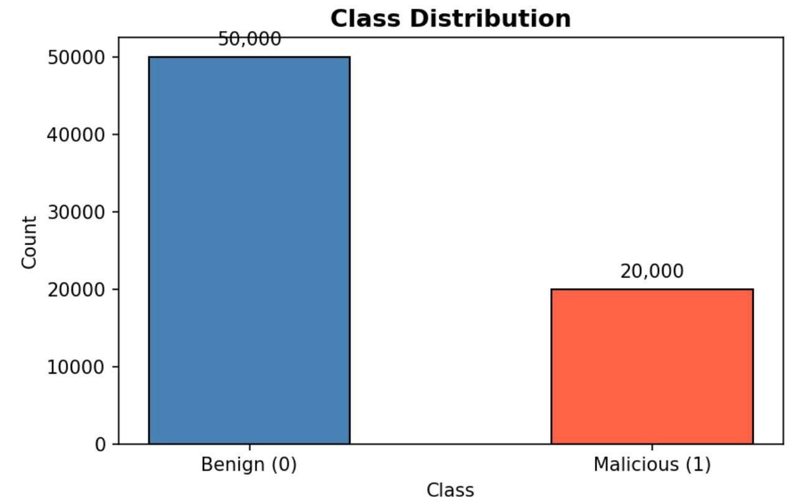
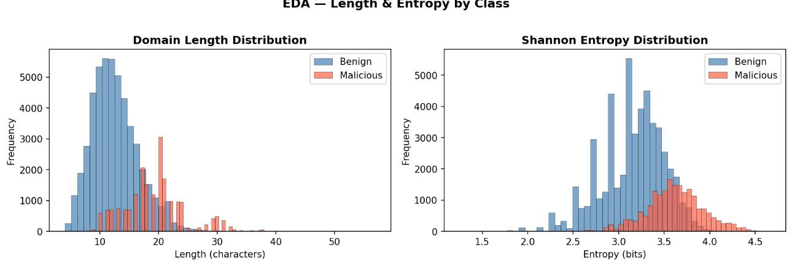
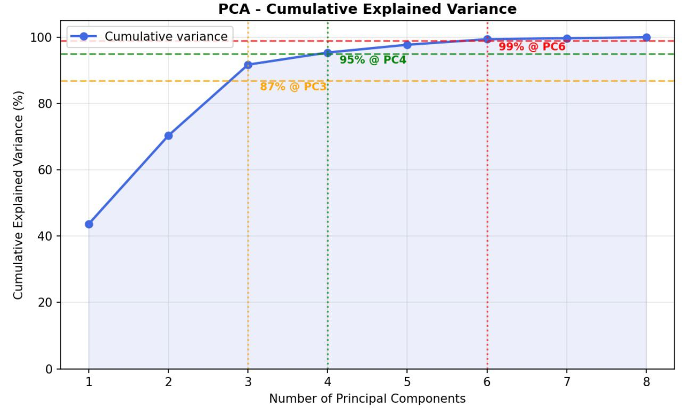
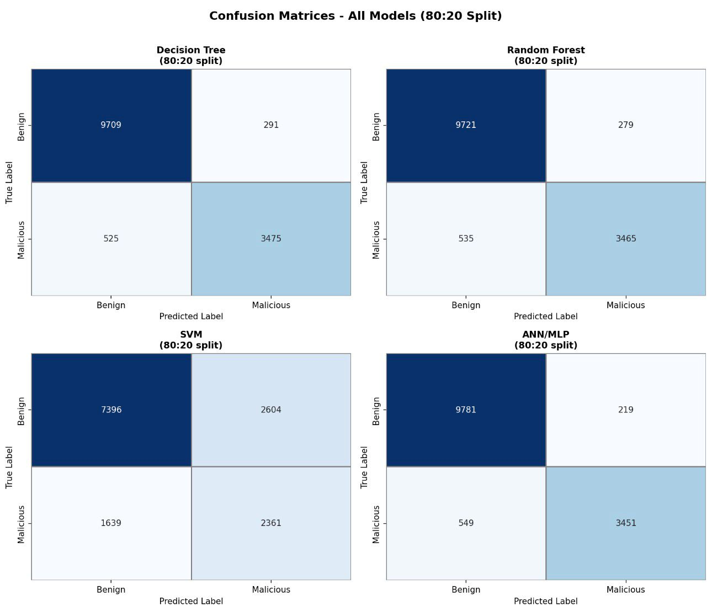
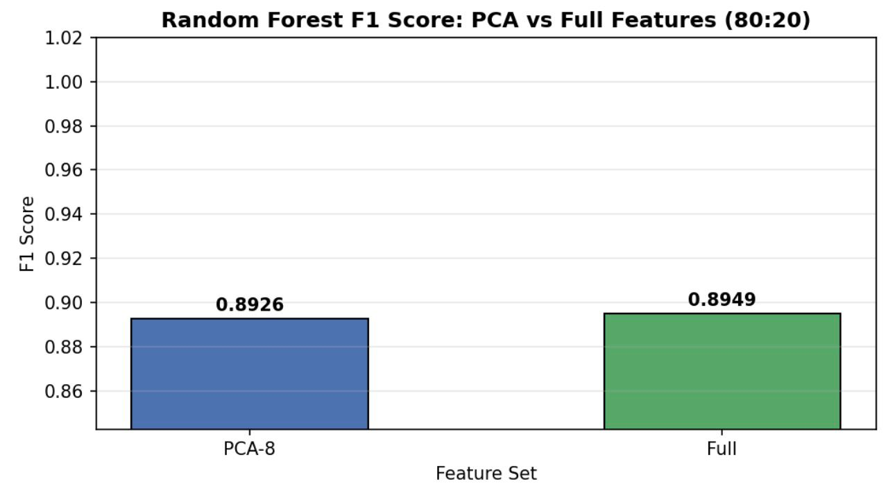
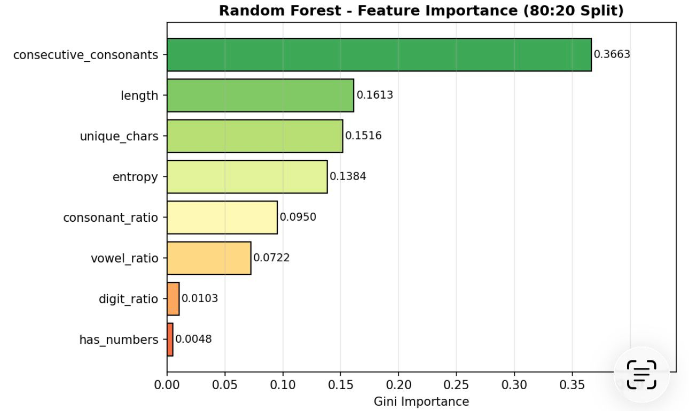
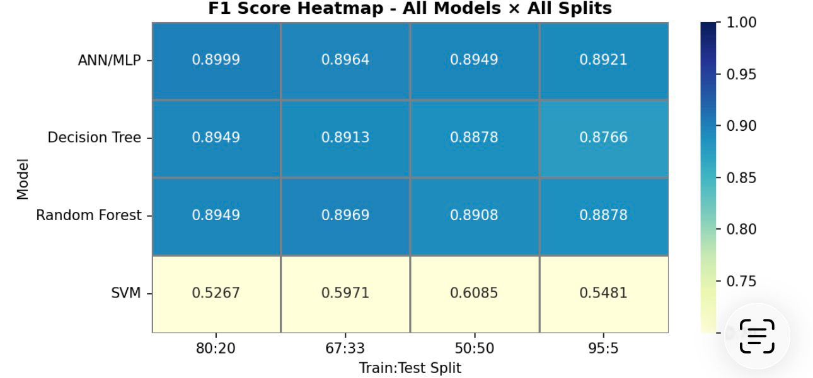

# DNS Anomaly Detection Using Machine Learning

Machine Learning Based DNS Threat Detection Using Lexical Feature Engineering and Cybersecurity Analytics

---

# Project Overview

This project focuses on detecting malicious DGA-generated domains using Machine Learning techniques.

Many malware families use Domain Generation Algorithms (DGAs) to continuously generate random-looking domains for command-and-control communication. Since these domains constantly change, traditional blacklist-based detection becomes less effective.

Instead of relying on packet captures or network traffic analysis, this project identifies suspicious domains directly from the domain name itself using lexical and statistical features.

---

# Why This Project Matters

DGA-based malware is commonly used by attackers to maintain resilient communication channels while bypassing traditional domain blacklists.

The goal of this project was to determine whether Machine Learning models could distinguish between:

- Human-created legitimate domains
- Algorithmically generated malicious domains

### Example

```text
google.com         → Legitimate
spotify.com        → Legitimate
xkqzpwrtq.biz      → Possible DGA-generated
```

MITRE ATT&CK Technique:

```text
T1568 – Dynamic Resolution
```

---

# Project Goals

- Build a DNS anomaly detection pipeline
- Analyze malicious vs legitimate domain patterns
- Extract meaningful lexical features
- Train and evaluate multiple ML models
- Compare model performance using F1-score
- Identify features contributing most to DGA detection

---

# Dataset

The dataset combined both legitimate and malicious domain names.

| Dataset | Label | Count |
|---|---|---|
| Alexa Top Domains | Benign | 50,000 |
| DGA Malware Domains | Malicious | 20,000 |

### Total Dataset Size

```text
70,000 domains
```

The class imbalance was intentionally preserved to better represent real-world DNS traffic environments.

---

# Technologies Used

| Technology |
|---|
| Python |
| Pandas |
| NumPy |
| Scikit-learn |
| Matplotlib |
| Seaborn |
| Jupyter Notebook |

---

# Machine Learning Workflow

```text
Raw Domain Names
        │
        ▼
Data Collection
        │
        ▼
Feature Engineering
        │
        ▼
Data Preprocessing
        │
        ▼
EDA & PCA Analysis
        │
        ▼
Model Training
        │
        ▼
Performance Evaluation
```

---

# Feature Engineering

Each domain was transformed into numerical features suitable for Machine Learning models.

## Extracted Features

| Feature | Description |
|---|---|
| length | Domain length |
| entropy | Shannon entropy |
| consecutive_consonants | Longest consonant sequence |
| unique_chars | Number of unique characters |
| vowel_ratio | Percentage of vowels |
| consonant_ratio | Percentage of consonants |
| digit_ratio | Percentage of digits |
| has_numbers | Presence of digits |

---

## Example Transformation

```text
google.com → google
xkqzpwrt.ru → xkqzpwrt
```

---

# Exploratory Data Analysis (EDA)

Before training the models, statistical differences between malicious and legitimate domains were analyzed.

### Key Findings

- DGA domains were generally longer
- Malicious domains showed higher entropy
- Consecutive consonants appeared more frequently
- DGA domains looked less human-readable

---

# Class Distribution

<p align="center">
  
</p>

---

# Domain Length & Entropy Analysis

<p align="center">
  
</p>

---

# Data Preprocessing

The preprocessing pipeline included:

- Null value removal
- Variance threshold filtering
- StandardScaler normalization
- Label encoding
- Stratified train-test splitting

### Evaluation Metric

F1-score was selected as the primary metric due to dataset imbalance.

---

# PCA Analysis

Principal Component Analysis (PCA) was used to analyze feature variance and dimensionality behavior.

---

# PCA Variance Analysis

<p align="center">
  
</p>

### PCA Insights

- Most variance was captured within the first few components
- PCA demonstrated dimensionality reduction concepts
- Minimal compression benefit existed due to compact feature count

---

# Machine Learning Models

The following models were trained and compared.

| Model |
|---|
| Decision Tree |
| Random Forest |
| Support Vector Machine (SVM) |
| Artificial Neural Network (ANN / MLP) |

### Train-Test Splits

```text
80:20
67:33
50:50
95:5
```

---

# Model Performance

## Best Performing Model

| Model | F1 Score |
|---|---|
| ANN / MLP | ~0.90 |

The ANN/MLP model achieved the highest overall detection performance.

---

# Confusion Matrix Comparison

<p align="center">
  
</p>

The ANN model achieved the lowest false positive rate among all evaluated models.

---

# PCA vs Full Feature Comparison

<p align="center">
  
</p>

PCA-reduced features showed minimal performance difference compared to the full feature set.

---

# Feature Importance Analysis

<p align="center">
  
</p>

### Important Insight

Initially, entropy appeared to be the strongest indicator during EDA.

However, Random Forest feature importance analysis showed:

```text
consecutive_consonants > entropy
```

This revealed that unreadable consonant-heavy domains were stronger indicators of DGA-generated behavior than randomness alone.

Example:

```text
xkqzpwrtq.biz
```

---

# F1 Score Heatmap

<p align="center">
  
</p>

The ANN/MLP model consistently achieved the best F1-score across multiple train-test splits.

---

# Challenges Faced

One challenge during the project was handling the imbalance between legitimate and malicious domains.

Since real-world DNS environments contain significantly more benign domains, selecting the correct evaluation metric became important.

Another challenge was identifying which lexical features actually contributed most to detection performance.

While entropy initially appeared highly important during EDA, feature importance analysis later revealed that consonant-heavy patterns were stronger indicators of DGA activity.

---

# Why This Matters for SOC Teams

DNS-based threat detection plays an important role in modern Security Operations Centers (SOCs).

This project demonstrates how Machine Learning can help analysts identify suspicious domains earlier in the attack lifecycle, even before deeper traffic analysis occurs.

Potential applications include:

- DNS threat monitoring
- Malware infrastructure detection
- SIEM enrichment
- Blue team threat hunting
- Early-stage anomaly detection

---

# Key Results

✅ Processed 70,000 DNS domains  
✅ Extracted 8 lexical features  
✅ Trained and evaluated 4 ML models  
✅ Achieved ~90% F1-score  
✅ Performed EDA, PCA, and feature importance analysis  
✅ Applied Machine Learning concepts to cybersecurity threat detection  

---

# Skills Demonstrated

- Machine Learning
- Cybersecurity Analytics
- DNS Security
- Threat Detection
- Feature Engineering
- Exploratory Data Analysis (EDA)
- PCA Analysis
- Model Evaluation
- F1-score Analysis
- Random Forest
- ANN / MLP
- Python
- Scikit-learn
- Data Preprocessing
- Blue Team Security Concepts

---

# Future Improvements

Potential future enhancements include:

- Real-time DNS monitoring
- Character n-gram analysis
- SMOTE imbalance handling
- Isolation Forest anomaly detection
- Detection of unseen DGA families
- SIEM integration for automated alerting

---

# Getting Started

## Install Requirements

```bash
pip install pandas numpy scikit-learn matplotlib seaborn jupyter
```

---

## Run the Notebook

```bash
jupyter notebook
```

Open:

```text
dns_anomaly_detection.ipynb
```

Run all notebook cells.

---

# Presentation

YouTube Presentation Link:

https://www.youtube.com/watch?v=BRD8PHBkOSc

The presentation includes:

- Project overview
- DGA threat explanation
- Dataset collection
- Feature engineering
- EDA analysis
- PCA analysis
- Model evaluation
- Final findings

---

# Conclusion

This project demonstrated how Machine Learning can support cybersecurity operations by identifying malicious DGA-generated domains using only lexical and statistical features.

Even without packet captures or network traffic analysis, the models successfully distinguished legitimate domains from malicious domains with strong performance.

The project combines practical Machine Learning workflows with real-world cybersecurity threat detection concepts relevant to SOC operations and blue team security analysis.

---

# References

- MITRE ATT&CK – T1568 Dynamic Resolution
- Scikit-learn Documentation
- Shannon Entropy Theory
- Alexa Top Sites

---
